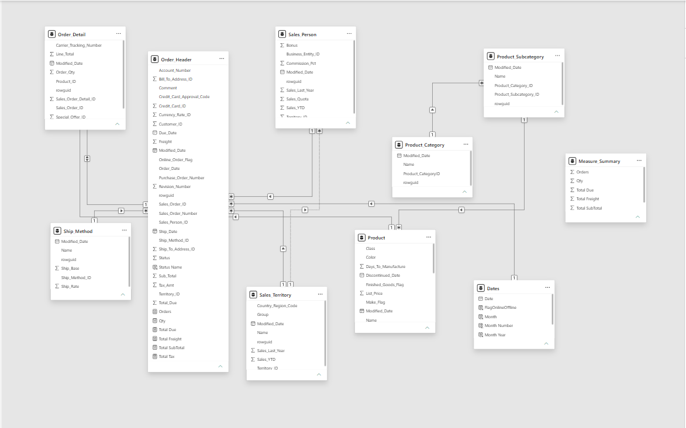
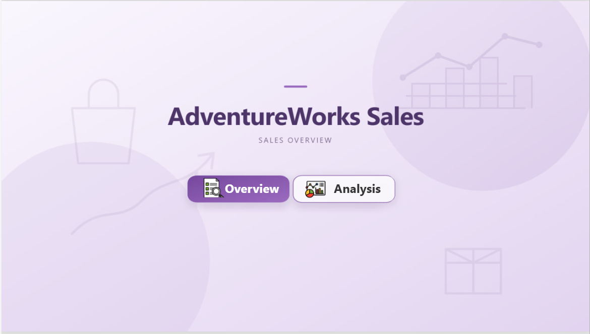
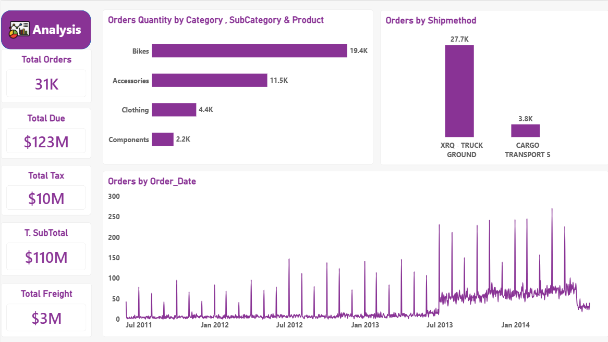
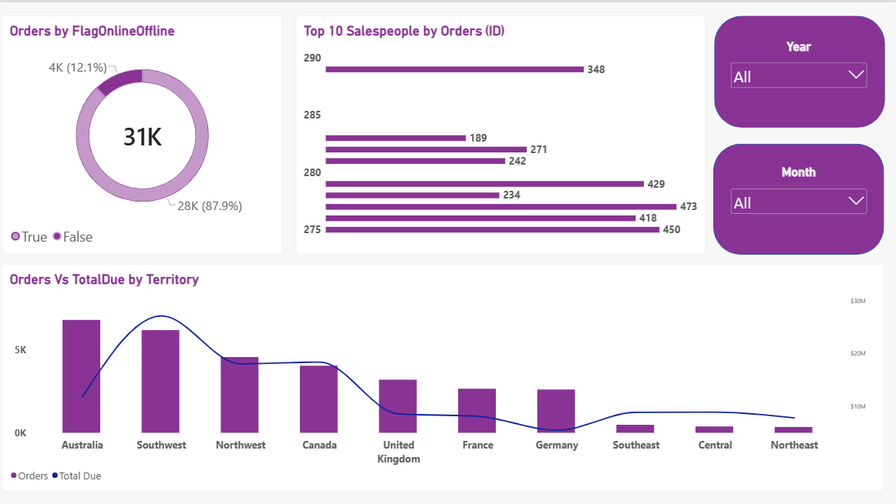

# AdventureWorks Sales Dashboard

## Project Overview

This project is a Power BI sales dashboard built using the AdventureWorks 2022 OLTP database. The dashboard provides an interactive overview of sales orders, products, territories, salespersons, shipping methods, and order statuses.

The project focuses on data preparation, data modeling, DAX measures, and interactive data visualization.

## Data Source

The project uses the AdventureWorks 2022 OLTP database provided by Microsoft.

### Main Tables

- Sales.SalesOrderHeader
- Sales.SalesOrderDetail
- Sales.SalesPerson
- Sales.SalesTerritory
- Purchasing.ShipMethod
- Production.Product
- Production.ProductSubcategory
- Production.ProductCategory

## Data Preparation

The data was prepared in Power BI by:

- Renaming tables and columns for better readability.
- Removing unused columns.
- Adding an Order Status column for better analysis.
- Creating a Date table using DAX.
- Building relationships between the required tables.

## Data Modeling

A data model was created to connect sales orders with products, product categories, territories, salespersons, shipping methods, and dates.

The model includes the main sales and product-related tables along with a dedicated Date table and a separate table for organizing the DAX measures.

### Data Model

The final data model is shown below:

## DAX Measures
The following measures were created:

- Number of Orders 
- Total SubTotal
- Total Tax
- Total Freight
- Total Due
- Number of Quantities

A separate DAX table was created to organize the measures.
## Dashboard

The final Power BI report consists of three pages:

### 1. Home

A navigation page that provides access to the Overview and Analysis pages.

### 2. Overview

The Overview page presents the main sales KPIs and an overall view of sales performance.

### 3. Analysis

The Analysis page provides detailed sales analysis using different visualizations and interactive slicers.

## KPI Cards

The dashboard includes the following KPI cards:

- # Orders
- Total SubTotal
- Total Tax
- Total Freight
- Total Due

## Visualizations

The dashboard includes:

- # Orders by Order Date
- # Orders by Order Status
- # Orders by Ship Method
- Order Quantity by Category, Subcategory, and Product
- # Orders by Online/Offline Flag
- Orders vs. Total Due by Territory
- Top 10 Salespersons by Orders

## Dashboard Features

- Drill Down
- Two interactive slicers
- KPI cards
- Interactive page navigation
- Meaningful chart titles
- Organized dashboard layout
- Clear and consistent visual design

## Tools Used

- Power BI Desktop
- DAX
- Power Query
- SQL Server
- AdventureWorks 2022

## Project Outcome
The final dashboard provides an interactive overview of AdventureWorks sales performance.
It allows users to explore orders, quantities, sales amounts, products, territories, shipping methods, order statuses, and salespersons through interactive visuals and slicers.

